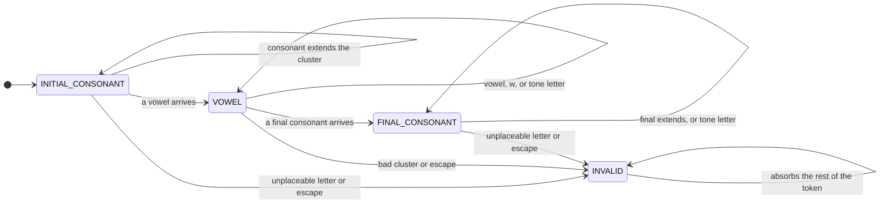

# Parsing

This document describes how [`decode`](../src/index.ts) turns Telex ASCII into Vietnamese Unicode through a small state machine. It covers decoding only; `encode` (the inverse) is a separate routine and is not part of this machine.

For the Telex rules themselves see [telex.md](telex.md); for the shape of a Vietnamese syllable see [vietnamese.md](vietnamese.md).

## Overview

Decoding is a **pure reducer** folded over the letters of each word. There is no mutable decoder object: the whole state of a parse-in-progress lives in a plain `ParseContext` value, and `parse` returns a *new* context for each letter.

A sketch of the driver:

```ts
for (const token of tokenize(text)) {
  if (isSeparator(token)) {
    emit(token); // spaces, punctuation, and digits pass through unchanged
    continue;
  }
  let ctx = {}; // a fresh, empty context per word
  for (const letter of token) {
    ctx = parse(ctx, letter, options); // fold one letter at a time
  }
  emit(finalize(ctx)); // turn the finished context into text
}
```

So a word is decoded in two phases: `parse` walks the letters and builds up a structured syllable, then `finalize` renders that syllable to output text.

## The Parse Context

A context *is* a syllable-in-progress. It carries the recognized syllable parts (a `Word`), each stored in **Telex form** rather than decoded Unicode — that way an escape stays a simple doubled character and the value is easy to read when logging.

Field | Holds | Telex Example | Decodes To
--- | --- | --- | ---
`initialConsonant` | Onset | `dd`, `ng`, `qu` | đ, ng, qu
`vowel` | Nucleus cluster | `uw`, `uaa` | ư, uâ
`finalConsonant` | Coda | `c`, `ch`, `ng` | c, ch, ng
`tone` | Tone letter `s`/`f`/`r`/`x`/`j` | `s` | ´ (dấu sắc)

On top of the `Word` parts, the context tracks the machine itself:

Field | Holds
--- | ---
`state` | The parser's current position in the syllable
`input` | The raw letters consumed so far, in their original case
`decoded` | The literal output text for an escaped, non-Vietnamese token

An empty `{}` is a valid starting context: `parse` defaults `state` to `INITIAL_CONSONANT` and `input` to `""` on the first letter.

## The State Machine

A Vietnamese syllable is an optional initial consonant, a vowel, then an optional final consonant. The parser walks exactly that shape, with one extra state — `INVALID` — as an error sink for anything that is not a valid syllable.



The progression only ever moves forward — initial consonant → vowel → final consonant → error — never back. When the token's letters run out, `finalize` is called on whatever state the machine has reached.

**Reprocessing.** A state that cannot place a letter does not throw it away; it hands the *same* letter to the next state's handler. So a single letter can drive more than one transition. In `gin`, the `n` arrives while the machine is still in `VOWEL` (the `i` of `gi` is the nucleus); `VOWEL` sees that `n` is a consonant and forwards it to `FINAL_CONSONANT`, which captures it. The net move is `VOWEL → FINAL_CONSONANT` on a single letter.

What each state does:

- **`INITIAL_CONSONANT`** greedily extends the onset while the accumulated letters are a prefix of a known initial (`n` → `ng` → `ngh`). A vowel ends the onset and hands off to `VOWEL`. For `gi`/`qu` the trailing i/u is itself the nucleus, so a tone or final arriving straight after also hands off to `VOWEL`.
- **`VOWEL`** accumulates the vowel cluster, but only while it stays a feasible prefix of some real Vietnamese nucleus, so dead-end clusters like `ea` are rejected early. A real consonant ends the vowel and hands off to `FINAL_CONSONANT`.
- **`FINAL_CONSONANT`** greedily extends the coda while it prefixes a valid final (`c` → `ch`, `n` → `ng`/`nh`). Nothing may follow a complete coda.
- **`INVALID`** is terminal. Once here the token is not a Vietnamese syllable; the remaining letters are absorbed so the original text can pass through.

## Tones

A tone is an orthogonal modifier, not a phase of its own, so it is handled *inside* both the `VOWEL` and `FINAL_CONSONANT` states rather than as a separate state. A tone letter (`s` sắc, `f` huyền, `r` hỏi, `x` ngã, `j` nặng, `z` ngang) sets the context's `tone` field instead of extending the current part:

- **Last wins.** A later tone letter overwrites an earlier one (`afs` → á).
- **`z` clears.** `z` is the neutral tone; it removes any mark (`asz` → a).
- **Position is free by default.** A tone may appear anywhere after the vowel, even mid-word (`mafu` → màu); see [Strict Modes](#strict-modes).

In the `INITIAL_CONSONANT` state these same letters are ordinary consonants (`s`/`r`/`x` begin `sa`/`ra`/`xa`), so they are only read as tones once a vowel has been seen.

## Escapes

Doubling the second character of a digraph or a tone letter **escapes** it, turning the token into literal passthrough text (see [telex.md](telex.md)). When an escape fires the token is no longer a Vietnamese syllable, so the parser:

1. computes the literal text and stores it in `decoded`,
2. abandons the partial `Word` parts, and
3. drops to `INVALID`.

So `decoded` is both the literal to emit and the flag that says "this token was an escaped literal."

Escape Kind | Example | Decoded
--- | --- | ---
Digraph | `ddd`, `aaa`, `Oww` | dd, aa, Ow
Tone | `ass`, `banss` | as, bans

**The `oo` exception.** Every doubled vowel digraph is inert literal text — *except* `oo`, which is a real Vietnamese nucleus (the rare *oo* of loanwords like *xoong*, itself typed `xooong`). So `ooo` stays a vowel and still decodes to `oo`, while `aaa`/`eee`/`oww`/… become literals. The principle: keep an escaped pair structured only if it is itself a valid Vietnamese vowel.

## Strict Modes

Two options in `DecodeOptions` tighten the parse. Both change *when* a token is rejected, not the basic state flow.

**`strictTones`** honors a tone only at the end of a word. Once a tone has been recorded, any further non-tone letter means the tone was mid-word, so the whole token drops to `INVALID` and passes through unchanged. This is the one rule that can reject a token the moment a letter arrives rather than at `finalize`: `thicsh` decodes to thích by default but stays `thicsh` under `strictTones`, because the `h` after the tone `s` fails immediately.

**`strictWords`** discards just the offending letter when it cannot be placed, and stays in the current state, instead of dropping the whole token to `INVALID`. A token is thus reduced to its largest valid Vietnamese skeleton as it goes: non-Vietnamese letters and invalid finals are trimmed (`fox` → õ, `teas` → té, `odd` → o, `bant` → ban). Because the discarded letter includes the escape character, digraph escapes are not honored under `strictWords` — the digraph simply decodes (`aaa` → â, `ddd` → đ).

## From Context To Output

`finalize` turns a finished context into text. It checks, in order:

1. `decoded` is set → return it (an escaped literal such as `dd` or `as`).
2. state is `INVALID` → return the raw `input` (plain passthrough, e.g. `fox`).
3. `validate` fails → return the raw `input` (a structurally impossible syllable that never escaped).
4. otherwise → `render` the `Word`.

`validate` is a deliberately lenient structural check: a known initial, a known final, and a vowel that decodes to a single Vietnamese vowel or a cluster in the `NUCLEI` table (with the gi/qu i/u allowed to complete it). It does not enforce the full spelling rules from [vietnamese.md](vietnamese.md) — doing so would reject open forms the decoder must still render, such as `uyế` or `ướ`.

`render` decodes every Telex part to Unicode and places the tone mark on the nucleus vowel. For `gi`/`qu` it counts the consonant's trailing i/u so the mark lands on the right vowel (`gias` → giá, with the mark on the a rather than the i of gi).

## Behavior Across Modes

Input | Default | Strict Tones | Strict Words
--- | --- | --- | ---
`phowr` | phở | phở | phở
`mafu` | màu | mafu | màu
`thicsh` | thích | thicsh | thích
`fox` | fox | fox | õ
`teas` | teas | teas | té
`odd` | odd | odd | o
`ddd` | dd | dd | đ
`ooo` | oo | oo | oo
`gii` | gii | gii | gii

## Worked Examples

`thicsh` → thích (a tone wedged inside a final digraph):

Letter | State | Word So Far
--- | --- | ---
— | INITIAL_CONSONANT | (empty)
`t` | INITIAL_CONSONANT | `t`
`h` | INITIAL_CONSONANT | `th`
`i` | VOWEL | `th` · `i`
`c` | FINAL_CONSONANT | `th` · `i` · `c`
`s` | FINAL_CONSONANT | `th` · `i` · `c` + tone `s`
`h` | FINAL_CONSONANT | `th` · `i` · `ch` + tone `s`

`finalize` → `render` → thích.

`ddd` → dd (a digraph escape):

Letter | State | Context
--- | --- | ---
`d` | INITIAL_CONSONANT | initial `d`
`d` | INITIAL_CONSONANT | initial `dd`
`d` | INVALID | escape fires → `decoded` = dd

`finalize` returns `decoded` → dd.

`fox` (passthrough by default vs. trimming under `strictWords`):

Mode | `f` | `o` | `x` | Result
--- | --- | --- | --- | ---
Default | → INVALID (`f` cannot start an onset) | absorbed | absorbed | raw input → fox
Strict Words | discarded, stays INITIAL_CONSONANT | vowel `o` | tone `x` | render → õ

## Why Four States, Not More

The four states map one-to-one onto the syllable — onset, nucleus, coda — plus the `INVALID` sink. Two places tempt extra states but are better left folded in:

- **The nucleus stays one `VOWEL` bucket.** Glide / nucleus / off-glide cannot be told apart mid-stream (`oa`, `oo`, `uy`), so the whole cluster is accumulated and judged once, at render, against `NUCLEI`. Splitting it would reintroduce that ambiguity and force backtracking.
- **The tone is a modifier, not a phase.** A `tone` field plus the doubled-letter escape look-back covers it. A dedicated tone state would have to remember whether to resume in `VOWEL` or `FINAL_CONSONANT` (lenient `mafu` keeps parsing after a mid-word tone), fragmenting the logic rather than simplifying it.
